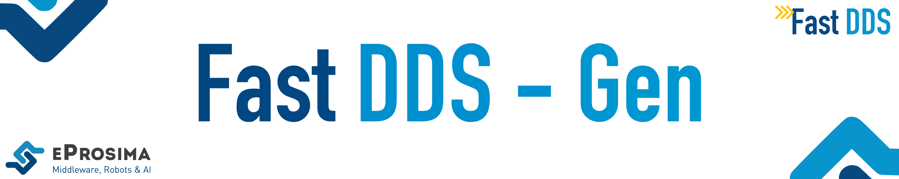

 

    <strong>
        <a href="https://eprosima.com/index.php/downloads-all">Download</a>
        &nbsp;&nbsp;•&nbsp;&nbsp;
        <a href="https://fast-dds.docs.eprosima.com/en/latest/fastddsgen/introduction/introduction.html">Docs</a>
        &nbsp;&nbsp;•&nbsp;&nbsp;
        <a href="https://eprosima.com/index.php/company-all/news">News</a>
        &nbsp;&nbsp;•&nbsp;&nbsp;
        <a href="https://x.com/EProsima">X</a>
        &nbsp;&nbsp;•&nbsp;&nbsp;
        <a href="mailto:info@eprosima.com">Contact Us</a>
    </strong>

  

    
    
    
    
    
     
    
    

  

*eProsima Fast DDS-Gen* is a Java tool to generate TypeSupport code compatible with [*eProsima Fast DDS*](https://github.com/eProsima/Fast-DDS) library.

## Commercial support

Looking for commercial support? Write us to info@eprosima.com

Find more about us at [eProsima’s webpage](https://eprosima.com/).

## Installation manual

Instructions about how to install and run the tool can be found in [Fast DDS installation manual](https://fast-dds.docs.eprosima.com/en/latest/installation/sources/sources_linux.html#fast-dds-gen-installation).

## Documentation

[Tool documentation](https://fast-dds.docs.eprosima.com/en/latest/fastddsgen/introduction/introduction.html) can be found with Fast DDS documentation.
